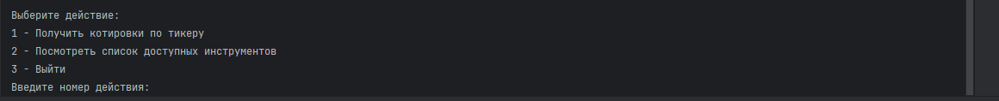

# MOEX APP

Консольное приложение для отслеживания стоимости акций, торгующихся на московской бирже. Приложение имеет меню с
буквенно-числовым выбором. Действия выбираются с помощью чисел, для поиска акций используется буквенный код - тикер. В
качестве результата выводится цена одной акции. Для того, чтобы узнать стоимость акции необходимо знать её тикер либо
посмотреть его в интернете, т.к. функция просмотра тикеров в приложении на данный момент не реализована.

## Использованные библиотеки и API

В работе использовалось обращение к API Московской биржи. А именно GET запрос на адрес:

```https://iss.moex.com/iss/engines/stock/markets/shares/boards/TQBR/securities.json?securities=~YOUR_TICKER~```

где `~YOUR_TICKER~` - тикер акции. Данный запрос предусматривает получение данных для нескольких акций (до 10 штук).
Поэтому приложение также способно обрабатывать такие запросы. Для этого необходимо через запятую указать тикеры
интересующих акций.

Также в работе использовалась библиотека для форматирования таблиц - ASCII Table Writer. Использование данной библиотеки
обусловлено тем, что стандартное форматирование таблиц не устраивало. 

## Запуск

```
cd cmd
go run main.go
```

## Пример работы


Рис.1 Главное меню


Рис.2 Форматированная таблица результатов

## Материалы

1. [API MOEX](https://www.moex.com/a2193)
2. [Справочник запросов к API MOEX](https://iss.moex.com/iss/reference/)
2. [Библиотека для форматирования таблиц - ASCII Table Writer](https://github.com/olekukonko/tablewriter)